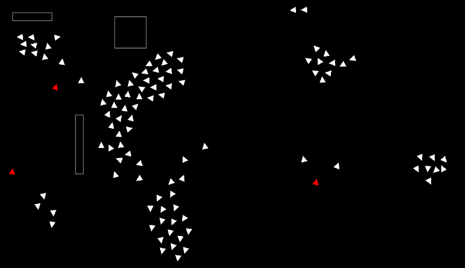

# 🐦 Boids Simulation

A fun and interactive simulation where little triangles (boids) mimic the natural flocking behavior of birds or fish.

🔗 **Live Demo:** [vanflux.github.io/boids-sim](https://vanflux.github.io/boids-sim/)

---

## ✨ Features

- **Cohesion** – Boids steer to stay close to their neighbors.
- **Alignment** – Boids match the direction of nearby boids.
- **Separation** – Boids avoid crowding each other.
- **Enemy Boids** – Red boids act as threats, triggering evasive movement.
- **Mouse Interaction** – Click to scare boids away from your cursor.
- **Wall Avoidance** – Boids automatically turn to avoid screen edges.

---

## 🖼️ Preview

## 📄 License

This project is open-source and available under the MIT License.

---

## 🛠️ Run locally

Requirements:
- Go lang 1.22.0 or higher
- `sudo apt install -y libc6-dev libgl1-mesa-dev libxcursor-dev libxi-dev libxinerama-dev libxrandr-dev libxxf86vm-dev libasound2-dev pkg-config`

Run: `cd sim && air`
